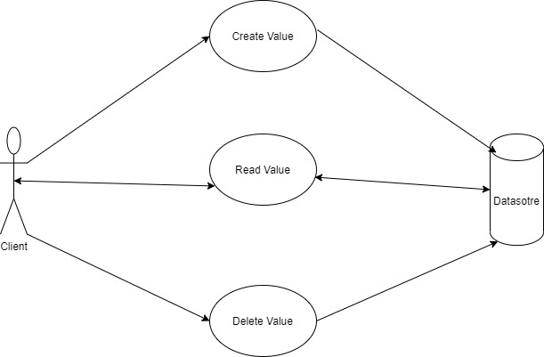
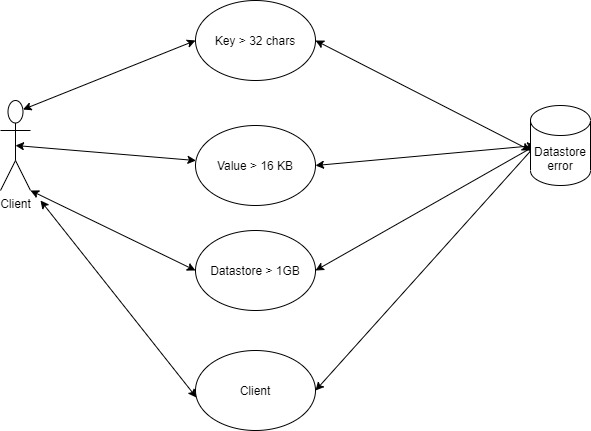

# Software design documentation 

---
## Table of Content
- [Introduction](@Introduction).
- [SystemOverview/Operation](@System Overview/Operation).
- [DesignPattern](@Design Pattern).
- [Testability](@Testability).
- [Conclusion](@Conclusion).

--- 

### 1. Introduction: 

 

To build a file-based key-value data store that supports the basic create, read and delete operations. This data store is meant to be used as a local storage for one single processor on one laptop and this is exposed as a library to clients that can instantiate a class and work with the data store. 

This data store will support some of the following functional requirements: 

A new key value pair can be added to these data store using the create operation. The key is always a string- capped at 32 chars. The value is always a JSON object capped at 16 KB. 

 If create is invoked for an existing key, an appropriate error must be returned. 

A read operation on a key can be performed by providing the Key and receiving the value in response, as a JSON object. 

A delete operation can also be performed by providing the key. 

Every Key supports setting a Time-To-live property when it is created. This will be evaluated as an integer defining the number of seconds the key must be retained in the data store. Once the TTL for a key has expired the key will no longer be available for read or delete operation. 

Appropriate error responses must always be returned to clients if it uses the data store in unexpected way or breaches any limits. 

 
---
 

### 2. System Overview/Operations: 

 

This data store can perform the following three operations: 

2.1.  Create: The value will be created in the datastore if the key does not exist already.   

2.2.  Read: The value will be returned if the key is present in the data store. 

2.3. Delete: The value will be deleted is the key is present in the data store. 

 ---
### 3. Design Pattern: 

#### 3.1. Usecase Diagram 1: 

#### 3.2. Usecase Diagram 2: 

 ---

### 4. Testability: 

 

#### 4.1. Unit Testing: 

 

#### 4.1.1. Create: 

 

If the key is already present in the data store then it will return an error stating key present or key cannot be overridden. 

If the key length exceeds more than 32 character then it will return an error stating limit exceeded. 

If the key format is an Alphanumeric character then in will return an error stating provide key is not valid.     

If the key is present in the data store with all the condition's then the JSON value is created. 

                  

#### 4.1.2. Read: 

 

If the key is not present in the data store it will return an error stating that the value is not present. 

If the key is present in the data store then it will return the JSON value. 

 

#### 4.1.3. Delete: 

If the key is not present in the data store then it will return an error stating that the value cannot be deleted. 

If the key is present in the datastore then it will delete the JSON value. 

---

### 5. Conclusion:

