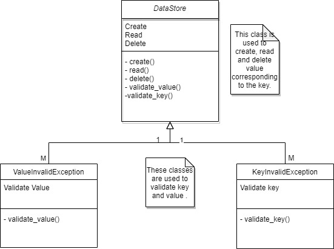
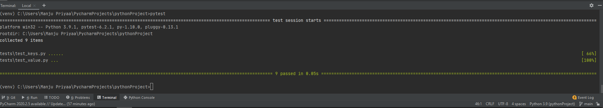

# Key-Value DataStore

---
## Table of Content
- [Introduction](@Introduction).
- [SystemOverview/Operation](@SystemOverview/Operation).
- [DesignPattern](@DesignPattern).
- [Testability](@Testability).
- [HowToUseDataStore](@HowToUseDataStore).
- [TechnologyUsed](@TechnologyUsed).
- [Conclusion](@Conclusion).

--- 

### 1. Introduction: 

 

To build a file-based key-value data store that supports the basic create, read and delete operations. This data store is meant to be used as a local storage for one single processor on one laptop and this is exposed as a library to clients that can instantiate a class and work with the data store. 

This data store will support some of the following functional requirements: 

A new key value pair can be added to these data store using the create operation. The key is always a string- capped at 32 chars. The value is always a JSON object capped at 16 KB. 

 If create is invoked for an existing key, an appropriate error must be returned. 

A read operation on a key can be performed by providing the Key and receiving the value in response, as a JSON object. 

A delete operation can also be performed by providing the key. 

Every Key supports setting a Time-To-live property when it is created. This will be evaluated as an integer defining the number of seconds the key must be retained in the data store. Once the TTL for a key has expired the key will no longer be available for read or delete operation. 

Appropriate error responses must always be returned to clients if it uses the data store in unexpected way or breaches any limits. 

 
---
 

### 2. System Overview/Operations: 

 

This data store can perform the following three operations: 

2.1.  Create: The value will be created in the datastore if the key does not exist already.   

2.2.  Read: The value will be returned if the key is present in the data store. 

2.3. Delete: The value will be deleted is the key is present in the data store. 

 ---
### 3. Design Pattern: 

#### 3.1. Usecase Diagram 1: 


#### 3.2. Usecase Diagram 2: 


#### 3.3. Class Diagram:



 ---

### 4. Testability: 

 

#### 4.1. Unit Testing: 

 

#### 4.1.1. Create: 

- If there is no value inside the create parameter then it returns an error, value not present.
```
def test_value_zero():
    with pytest.raises(ValueInvalidException):
        o = DataStore(key='test1')
        o.create(value='')
        o.delete()
```
- If the length of the value is greater than 16 KB then it returns an error, limit exceeded.
```
def test_value_more_than_16_KB():
    with pytest.raises(ValueInvalidException):
        o = DataStore(key='test2')
        o.create(value= 'aaaaaaaaaaaaa...upto17kb)
```
- If the type of the value is not an JSON value then it returns an error, type invalid.
```
def test_value_not_JSON():
    with pytest.raises(TypeError):
        o = DataStore(key='test3')
        o.create(123)
        o.delete()
```

- If the key is already present in the data store then it returns an error, key present or key cannot be overridden. 
```
def test_create_for_same_key():
    with pytest.raises(FileExistsError):
        # If same file executed twice raise File exists error.
        o = DataStore(key='test3')
        o.create(value={'1': 1})
        o = DataStore(key='test3')
        o.create(value={'1': 2})
    o.delete()
```
- If the key length exceeds more than 32 character then it returns an error, limit exceeded. 
```
def test_key_more_than_33_char():
    with pytest.raises(KeyInvalidException):
        o = DataStore(key='some_large_keysome_large_keysome_large_keysome_large_keysome_large_keysome_large_key')

```
- If the key format is not an string then it returns an error, key is not valid.     
```
def test_key_not_string():
    with pytest.raises(KeyInvalidException):
        o = DataStore(key=1234)
```
- If the key is present in the data store with all the condition's then the JSON value is created. 
          

#### 4.1.2. Read: 

 

- If the key is not present in the data store it will return an error, the value is not present.
```
def test_read_non_existent_key():
    with pytest.raises(FileNotFoundError):
        # If the file does not exists.
        o = DataStore(key='test4')
        o.read()
``` 

- If the key is present in the data store then it will return the JSON value. 

 

#### 4.1.3. Delete: 

- If the key is not present in the data store then it will return an error stating, the value cannot be deleted. 
```
def test_delete_not_existent_key():
    with pytest.raises(FileNotFoundError):
        # If the file does not exists.
        o = DataStore(key='test5')
        o.delete()
``` 

- If the key is present in the datastore then it will delete the JSON value. 

#### 4.2. Results

Screen Shots


---

### 5. How to Use Data Store

#### 5.1.  Creating a Key
To create a key, you should create an object of the class DataStore with your key.
Call the create function from the object with your value.
```
data = DataStore(key='key1')
data.create(value={"json": "data"})
```
#### 5.2. Reading a Value
To read a value, you should create an object of the class DataStore with your key
Call the read function from the object.
```
data = DataStore(key='key1')
data.create(value={"json": "data"})
print(data.read()) 
```
#### 5.2. Deleting a Value
To delete a value, you should create an object of the class DataStore with your key
Call the delete function from the object.
```
data = DataStore(key='key1')
data.create(value={"json": "data"})
print(data.read()) 
data.delete()
```
---

### 6. Technology Used
1. Language - Python
2. IDE - Pycharm
3. Testing - Pytest
4. OS - Windows

---
### 7. Conclusion:


